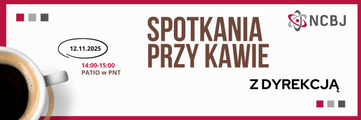

Ogłoszenia
-----------------------------------

Kawa z dyrekcją NCBJ.
======================

Szanowni Państwo,

od przyszłego tygodnia rozpoczynamy cykl spotkań "Kawa z dyrekcją NCBJ". Ich celem jest stworzenie przestrzeni do rozmowy na temat wszystkich spraw, które chcieliby Państwo bezpośrednio omówić z przedstawicielami dyrekcji.

Ta nieformalna forma będzie również okazją do zadawania pytań i uzyskania odpowiedzi bezpośrednio u źródła. Dzięki temu będziecie Państwo mogli na bieżąco weryfikować informacje dotyczące funkcjonowania Instytutu.

Pierwsze spotkanie z udziałem prof. Jakuba Kupeckiego i dr Marcina Kardasa odbędzie się już w środę - 12 listopada w godzinach 14:00-15:00 w PNT.

Serdecznie zapraszamy!

Zapraszamy do współpracy przy publikowaniu informacji o osiągnięciach!
========================================================================

Szanowni Państwo, zapraszamy do współpracy z Biurem Komunikacji i Promocji. Jednym z głównych zadań Biura jest publikowanie informacji o najnowszych osiągnięciach pracowników naszego Instytutu. Cieszymy się, gdy możemy wypromować w mediach artykuł z wynikami Państwa badań. Zależy nam na tym, aby komunikat trafił do szerokiego grona odbiorców, zarówno zewnętrznych (poza NCBJ), jak i wewnętrznych (pracowników NCBJ). W ten sposób nie tylko promujemy osiągnięcia autora/autorów badań, ale również Narodowe Centrum Badań Jądrowych. Działania te mają realny wpływ na zwiększenie świadomości społeczeństwa o rozwoju polskiej nauki i jej wpływie na inne dziedziny życia.

Biuro Komunikacji i Promocji przygotuje pakiet materiałów komunikacyjnych:

    - informacje na stronę internetową NCBJ,
    - posty na oficjalne profile NCBJ w mediach społecznościowych,
    - komunikat do mediów ogólnopolskich.

Aby zwiększyć skuteczność działań promocyjnych i popularyzatorskich gorąco zachęcamy do przesyłania informacji o planowanych przez Państwa publikacjach w prasie naukowej. Materiały prosimy wysyłać na adres mailowy IK@ncbj.gov.pl.

Z naszej strony gwarantujemy dyskrecję (do momentu publikacji Państwa artykułu), profesjonalizm, wysoką jakość umiejętności popularyzatorskich oraz wsparcie w przygotowaniu planu promocji.

Jesteśmy otwarci na wszelkie propozycję współpracy i mamy nadzieję, że wspólnie zadbamy o rozwój i przyszłość polskiej nauki.